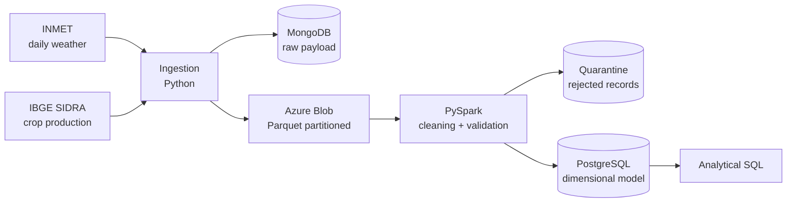

# Agro-climatic Data Pipeline

Data pipeline that cross-references INMET daily weather series with IBGE municipal
agricultural production data to answer whether climate variation explains
productivity variation by crop and municipality.

## Architecture



Medallion architecture (bronze/silver/gold), orchestrated with Airflow and running
on Docker Compose.

## Stack

| Layer | Tool | Rationale |
|---|---|---|
| Ingestion | Python | REST API consumption with retry and rate limiting, plus CSV file parsing |
| Raw | MongoDB | Semi-structured payload with unstable schema. Storing it raw allows reprocessing without calling the source again |
| Bronze | Azure Blob + Parquet | Cheap storage, columnar format, partitioned by date |
| Silver | PySpark | Same API as a cluster, even running locally |
| Gold | PostgreSQL | Dimensional model for analytical queries |
| Orchestration | Airflow | Daily DAG, task dependencies, retry, backfill |
| Infrastructure | Docker Compose | Reproducible environment with a single command |

## Data sources

**INMET** provides daily weather data from automatic stations, including
temperature, rainfall and humidity.

**IBGE SIDRA** provides the Municipal Agricultural Production survey (table 5457)
with planted area, output and average yield by municipality and crop.

## Getting started

```bash
cp .env.example .env    # fill in your credentials
docker compose up -d
docker compose ps       # postgres and mongo should report healthy
```

## Project status

Work in progress. Current stage: local environment.

- [x] Local environment (PostgreSQL + MongoDB via Docker Compose)
- [ ] Weather and crop production ingestion with structured logging
- [ ] Bronze layer as partitioned Parquet on Azure Blob
- [ ] Silver layer with data quality validation and quarantine
- [ ] Dimensional model in the gold layer
- [ ] Airflow orchestration
- [ ] Final analysis and documented results

## Roadmap

Sections to be added as the project evolves:

- **Technical decisions**: source selection, idempotency, partitioning strategy
- **Data quality**: implemented rules and observed metrics
- **Results**: processed volume, runtime, rejection rate, analytical findings
- **Limitations and next steps**