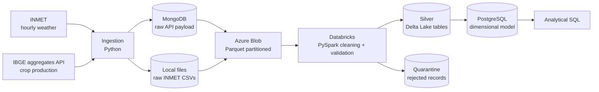

# Agro-climatic Data Pipeline

Data pipeline that cross-references INMET weather series with IBGE municipal
agricultural production data to answer whether climate variation explains
productivity variation by crop and municipality.

## Architecture


```mermaid
flowchart LR
    INMET[INMET<br/>hourly weather] --> ING[Ingestion<br/>Python]
    IBGE[IBGE aggregates API<br/>crop production] --> ING
    ING --> MONGO[(MongoDB<br/>raw API payload)]
    ING --> CSV[(Local files<br/>raw INMET CSVs)]
    MONGO --> BRONZE[Azure Blob<br/>Parquet partitioned]
    CSV --> BRONZE
    BRONZE --> SPARK[Databricks<br/>PySpark cleaning + validation]
    SPARK --> SILVER[(Silver<br/>Delta Lake tables)]
    SPARK --> QUAR[(Quarantine<br/>rejected records)]
    SILVER --> GOLD[(PostgreSQL<br/>dimensional model)]
    GOLD --> SQL[Analytical SQL]
```

Medallion architecture (bronze/silver/gold), orchestrated with Airflow and running
on Docker Compose. Transformations run on Databricks and write the silver layer as
Delta Lake tables.

## Stack

| Layer | Tool | Rationale |
|---|---|---|
| Ingestion | Python | REST API consumption and annual archive download, with retry and exponential backoff for transient errors |
| Raw | MongoDB + local CSV files | Each source is stored in its native format as received, allowing reprocessing without calling the source again |
| Bronze | Azure Blob + Parquet | Cheap storage, columnar format, partitioned by date |
| Silver | Databricks + PySpark + Delta Lake | Spark transformations on a managed platform; Delta adds ACID writes, MERGE (upsert) and time travel on top of Parquet |
| Gold | PostgreSQL | Dimensional model for analytical queries |
| Orchestration | Airflow | Daily DAG, task dependencies, retry, backfill |
| Infrastructure | Docker Compose | Reproducible environment with a single command |

Transformation logic lives in plain Python functions inside the repository, which
take and return Spark DataFrames. They are tested locally with pytest and a local
Spark session, and the Databricks job only imports and runs them. This keeps the
logic portable and independent of the platform.

## Data sources

**INMET** provides hourly weather data from automatic stations (rainfall, temperature,
humidity, among others), published as one annual archive per year covering every station
in Brazil. The pipeline downloads 2015 to 2025 and keeps only the stations in Paraná.

**IBGE** provides the Municipal Agricultural Production survey (table 5457) through its
aggregates API, with planted area, output and average yield by municipality and crop.

## Getting started

```bash
cp .env.example .env    # fill in your credentials
docker compose up -d
docker compose ps       # postgres and mongo should report healthy
```

### Development setup

```bash
python3 -m venv .venv
source .venv/bin/activate
pip install -r requirements-dev.txt
```

Linting and formatting are handled by Ruff:

```bash
ruff check .
ruff format .
```

### Running the ingestion

```bash
python run_ingestion.py
```

Runs two steps:

- **Crop production:** fetches data for all municipalities in Paraná from the IBGE
  aggregates API in a single request, and stores the raw payload in MongoDB along with
  the request parameters used to retrieve it.
- **Weather:** downloads the INMET annual archives, extracts only the station files for
  Paraná into `data/raw/inmet/PR/{year}/`, and deletes the national archive afterwards.
  Years already extracted are skipped.

## Project status

Work in progress. Current stage: ingestion layer.

- [x] Local environment (PostgreSQL + MongoDB via Docker Compose)
- [x] Crop production ingestion from the IBGE aggregates API
- [x] Weather data ingestion from INMET annual archives
- [x] Raw storage (MongoDB for API payloads, CSV files for INMET)
- [ ] Structured logging and tests for the ingestion layer
- [ ] Bronze layer as partitioned Parquet on Azure Blob
- [ ] Silver layer on Databricks, written as Delta Lake, with data quality validation and quarantine
- [ ] Dimensional model in the gold layer
- [ ] Airflow orchestration
- [ ] Final analysis and documented results

## Limitations and next steps

- **Spark and Databricks are more than this volume needs.** The full dataset is around
  2.5 million hourly weather rows plus about 24 thousand crop production records, which
  pandas or DuckDB would process in seconds on a laptop. Spark and Databricks were
  chosen on purpose, to practice the tools used for data at scale. They start to pay
  off when the data no longer fits comfortably in a single machine's memory, for
  example all Brazilian states, more crops, or a longer history.
- **MongoDB in the raw layer is partly redundant.** The raw JSON could land directly in
  Azure Blob Storage, which is the more common pattern. MongoDB was kept to work with a
  document store.
- **The gold layer is stored twice.** Data lives in Azure Blob and again in PostgreSQL,
  which provides SQL, constraints and idempotent upserts. A full lakehouse (Delta tables
  plus a query engine and a catalog) would remove the second copy, at the cost of more
  infrastructure.

## Roadmap

Sections to be added as the project evolves:

- **Technical decisions**: source selection, idempotency, partitioning strategy
- **Data quality**: implemented rules and observed metrics
- **Results**: processed volume, runtime, rejection rate, analytical findings